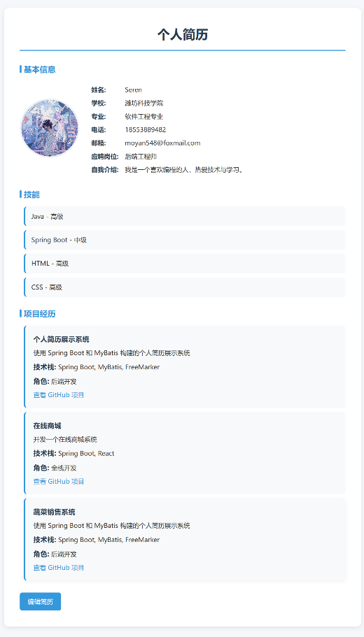
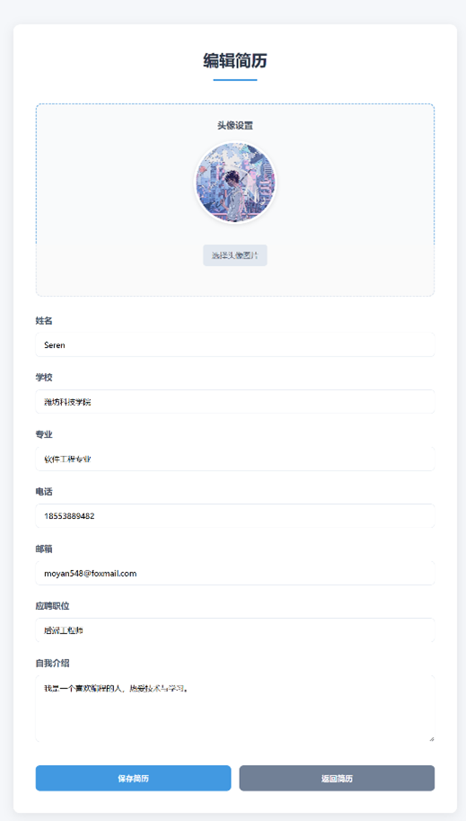

# 简历系统 (Resume System)

一个基于 Spring Boot 和 MyBatis 的在线简历管理系统。

## 项目简介

本项目是一个功能完整的简历管理系统，提供了用户简历的创建、编辑、查看等功能。支持头像上传、项目经历管理、技能展示等功能。采用现代化的 Web 技术栈，界面简洁美观，操作便捷。

## 技术栈

- **后端框架**: Spring Boot 2.x
- **ORM框架**: MyBatis / JPA
- **数据库**: MySQL (通过 JPA)
- **模板引擎**: FreeMarker (FTL)
- **前端技术**: HTML5, CSS3, JavaScript
- **构建工具**: Maven
- **文件存储**: 本地文件系统
- **开发工具**: Spring Tool Suite (STS) 或 IDEA

## 主要功能

### 用户管理
- 创建和编辑个人简历
- 上传个人头像
- 管理基本信息（姓名、学校、专业、联系方式等）
- 个人简介和职位信息

### 项目经历
- 添加多个项目经历
- 每个项目包含：项目名称、描述、技术栈、角色、GitHub 链接等
- 支持项目与用户关联

### 技能管理
- 添加个人技能
- 设置技能熟练度
- 支持技能与用户关联

### 简历展示
- 在线查看简历
- 简历编辑功能
- 美观的简历模板

## 项目结构

```
resume-system/
├── src/main/
│   ├── java/com/boot/mybatis/resumesystem/
│   │   ├── ResumeSystemApplication.java        # Spring Boot 启动类
│   │   ├── config/
│   │   │   └── WebConfig.java                  # Web 配置类（资源配置）
│   │   ├── controller/
│   │   │   ├── FileController.java             # 文件上传控制器
│   │   │   └── UserController.java             # 用户简历控制器
│   │   ├── entity/
│   │   │   ├── User.java                       # 用户实体
│   │   │   ├── Project.java                    # 项目实体
│   │   │   └── Skill.java                      # 技能实体
│   │   ├── repository/
│   │   │   ├── UserRepository.java             # 用户数据访问层
│   │   │   ├── ProjectRepository.java          # 项目数据访问层
│   │   │   └── SkillRepository.java            # 技能数据访问层
│   │   ├── service/
│   │   │   ├── UserService.java                # 用户业务逻辑层
│   │   │   ├── ProjectService.java             # 项目业务逻辑层
│   │   │   └── SkillService.java               # 技能业务逻辑层
│   │   └── util/
│   │       └── FileUploadUtil.java             # 文件上传工具类
│   └── resources/
│       ├── application.properties              # 应用配置文件
│       ├── static/css/styles.css               # 样式文件
│       └── templates/                          # FreeMarker 模板
│           ├── resume.ftl                      # 简历展示页面
│           ├── resume-edit.ftl                 # 简历编辑页面
│           └── error.ftl                       # 错误页面
├── uploads/avatars/                            # 头像上传目录
├── mvnw                                        # Maven 包装器脚本 (Linux/Mac)
├── mvnw.cmd                                    # Maven 包装器脚本 (Windows)
└── pom.xml                                     # Maven 项目配置
```

## 环境要求

- JDK 1.8 或更高版本
- Maven 3.6 或更高版本
- MySQL 5.7 或更高版本
- Tomcat 9.x (可选，Spring Boot 内嵌 Tomcat)

## 快速开始

### 1. 克隆项目

```bash
git clone https://gitee.com/yanqinglanyanmo/resume-system.git
cd resume-system
```

### 2. 数据库配置

在 MySQL 中创建数据库：

```sql
CREATE DATABASE resume_system DEFAULT CHARACTER SET utf8mb4 COLLATE utf8mb4_unicode_ci;
```

然后在 `application.properties` 中配置数据库连接信息：

```properties
spring.datasource.url=jdbc:mysql://localhost:3306/resume_system?useSSL=false&serverTimezone=UTC
spring.datasource.username=your_username
spring.datasource.password=your_password
spring.datasource.driver-class-name=com.mysql.cj.jdbc.Driver

# JPA 配置
spring.jpa.hibernate.ddl-auto=update
spring.jpa.show-sql=true
spring.jpa.properties.hibernate.format_sql=true
```

### 3. 配置头像上传路径

在 `application.properties` 中配置头像上传路径：

```properties
avatar.upload.path=/path/to/your/project/uploads/avatars/
avatar.access.path=/avatars/
```

### 4. 编译运行

使用 Maven 编译项目：

```bash
./mvnw clean package
```

运行项目：

```bash
java -jar target/resume-system-0.0.1-SNAPSHOT.jar
```

或者使用 Maven 运行：

```bash
./mvnw spring-boot:run
```

### 5. 访问应用

打开浏览器访问：http://localhost:8080

## API 接口

### 文件上传接口

**POST** `/file/upload-avatar`

上传用户头像。

| 参数 | 类型 | 必填 | 说明 |
|------|------|------|------|
| file | File | 是 | 头像文件 |
| userId | Long | 是 | 用户 ID |

### 简历查看接口

**GET** `/resume/{id}`

查看用户简历。

| 参数 | 类型 | 必填 | 说明 |
|------|------|------|------|
| id | Long | 是 | 用户 ID |

### 简历编辑页面

**GET** `/resume/edit/{id}`

编辑用户简历页面。

### 简历更新接口

**POST** `/resume/update/{id}`

更新用户简历。

| 参数 | 类型 | 必填 | 说明 |
|------|------|------|------|
| id | Long | 是 | 用户 ID |
| name | String | 是 | 姓名 |
| school | String | 是 | 学校 |
| major | String | 是 | 专业 |
| phone | String | 是 | 电话 |
| email | String | 是 | 邮箱 |
| introduction | String | 是 | 个人简介 |
| avatar | String | 否 | 头像文件名 |
| avatarFile | File | 否 | 头像文件 |
| position | String | 否 | 职位 |

## 项目截图

### 简历展示页面
- 展示用户基本信息
- 显示项目经历和技能
- 简洁美观的布局设计

### 简历编辑页面
- 支持在线编辑简历信息
- 头像上传预览功能
- 表单验证和错误提示

## 目录说明

### 上传目录
- `uploads/avatars/` - 存储用户上传的头像文件
- 文件名格式：`UUID.jpg`（防止文件名冲突）

### 静态资源
- `src/main/resources/static/` - 存放静态资源文件
- `css/styles.css` - 项目样式文件

### 模板文件
- `src/main/resources/templates/` - FreeMarker 模板文件
- `resume.ftl` - 简历展示模板
- `resume-edit.ftl` - 简历编辑模板
- `error.ftl` - 错误页面模板

## 许可证

本项目遵循 MIT 许可证开源。

## 贡献者

感谢所有为这个项目做出贡献的人！

## 联系方式

- 项目地址：https://gitee.com/yanqinglanyanmo/resume-system
- 作者：yanqinglanyanmo
## 页面展示


如有任何问题或建议，欢迎提交 Issue 或 Pull Request。